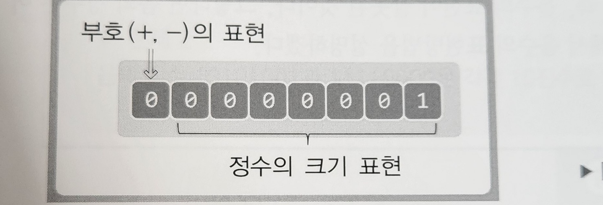
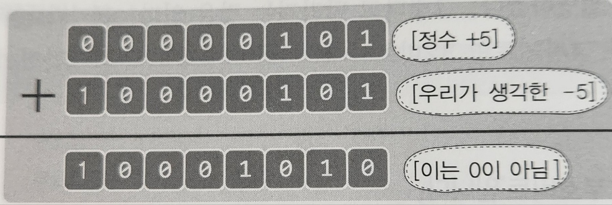

# 데이터 표현 방식의 이해

---

## 컴퓨터가 데이터를 표현하는 방식

- 컴퓨터의 데이터 표현과 연산의 진행은 2진수를 기반으로
- 2진수, 10진수, 16진수
    - 수 몇개를 통해서 데이터를 표현하는가

## 데이터의 표현 단위인 비트(bit)와 바이트(byte) & 2진수

- 비트 = 컴퓨터가 표현하는 데이터의 최소단위, 2진수 값 하나를 저장할 수 있는 메모리 최소 단위
- 바이트 = 8개의 비트 묶음

## C언어 특

- 10, 16 진수 이외에 8진수로도 데이터 표현 가능
- 단 표현 방식만 다를뿐 저장되는 값이 달라지는건 아니다.
    - 그리고 내부적으로는 2진수의 형태로 값을 저장

```c
int num = 10;
int num = 0xA; //0x으로 시작하면 16진수
int num = 012; //0으로 시작하면 8진수
- ```

# 정수, 실수, 문자의 표현 방식

- 세개를 표현하는데 두드러진 차이가 있다
- 1바이트 기준
-

## 정수



- MSB(Most Significant Bit)
    - +,-를 표현하는 비트로 가장 왼쪽에 위치
    - 0이면 +를 표현, 1이면 -를 표현
        - 그래서 수를 표현하는 범위에서 -1 이었다는걸 잊지말자 (-2^n ~ 2^n - 1)
- 양수를 표현 할 때
    - 생각한 그대로 표현하면 된다
    - 5 = 00000101
- `음수를 표현 할 때` : 2의 보수(complement)를 취해야한다
    - 왜? 그냥 MSB만 1로 바꾸면 되는거 아닌가?
        - 
    - 보수?
        - `각 자리의 숫자합이 어느 일정한 수가 되게 하는 수`
          - 보통 현재 숫자에서 자릿수가 한단계 올라가게 하기 위한 수
        - 보충해주는 수, 컴퓨터가 뺄셈을 할 때 사용되는 개념
        - 왜 필요한가?
            - 컴퓨터는 뺄셈을 할 수 없다.
            - `그래서 컴퓨터는 x - y를 x + (-y)로 바꿔서 처리한다.`
            - 이때 +(-y)가 보수이며 2진법으로 표현된 수를 보수로 바꿔주는 걸 `보수 표현` 이라고 한다.
    - 보수 표현의 종류: 1의 보수
      - `2진수에서 1을 뺀 커다란 2의 제곱수에서 어떤수를 빼서 얻은 값`
      - 6의 1의 보수표현
        - 6의 2진수 표현 = 110 -> 어떤수
        - 1000은 커다란 2의 제곱수
        - 1000 - 1 = 111 -> 1을 뺀 커다란 2의 제곱수
        - 111 - 110 = 001 -> 110의 보수 
        - `다 시끄럽고, 그냥 0은 1로, 1은 0으로 바꾸면 된다`
    - 보수 표현의 종류: 2의 보수
      - 1의 보수 표현에서 1을 더해준다
- 1의 보수의 뺄셈
  - 1의 보수의 덧셈으로 바꾸고 
    - 최상위 비트에 자리 올림이 생기면 최상위 비트를 지우고 1을 더한다
    - 자리 올림이 안생기면 연산 결과에 대한 1의 보수를 구한후 -부호 붙인다
  - 2의 보수의 뺄셈
    - 2의 보수의 덧셈으로 바꾼다.
    - 자리 올림이 생기면 자리올림을 제외한 나머지 부분이 답
    - 자리 올림이 안생겼다면 연산결과의 2의 보수를 구한후 -부호 붙인다.
- 곱셈
  - 부분씩 떼서 곱한 후(부분곱) 더한다
- 나눗셈
  - 뺄셈으로 구현

## 실수의 표현 방식

- 실수의 표현방식은 너무 다양하여 제한된 비트내에서 표현하기가 힘들 수도 있다.
- 그래서 컴퓨터가 적은 비트를 가지고 넓은 범위의 실수를 표현하기 위해 하나의 식을 정의한다.


부동 소수점 방식

- `하지만 이 방식으로 넓은 범위의 실수를 표현할수있지만, 실수의 표현에도 오차는 존재한다.`
- `즉, 컴퓨터는 실수를 정확히 표현하는게 아니라, 아주 가까운, 문제가 없을 만큼의 근사치를 통해서 실수를 표현한다.`
- `실수의 오차 = 부동 소수점 오차`


## 비트연산자

- 비트 반위로 연산은 진행하는 비트연산자
- 주로 하드웨어 프로그래밍에 활용되지만, 메모리 공간의 효율성을 높이고 연산의 수를 줄일수도 있다.

- `and(&)연산자`
  - 둘다 0이면 0, 1이면 1
- `or(|) 연산자`
  - 둘중에 하나라도 1이면 1을 반환
- `xor(^) 연산자`
  - 서로의 비트가 다를시에 1반환
  - `보수 연산`
- `not(~) 연산자`
  - 비트를 0에서 1로, 1에서 0으로
  - `MSB도 바뀐다`
- `시프트 연산자(<<, >>)`
  - 왼쪽이나 오른쪽으로 이동해라 n칸씩
  - `왼쪽이동 <<`
    - 이동으로 인해 밀려나는 비트들(4바이트를 넘는)은 그냥 버려진다
    - `왼쪽으로 이동할때마다 곱하기 2가되고, 오른쪽으로 이동할때마다 나누기 2가된다`
    - CPU에겐 곱셈 나눗셈이 비트 이동보다 부담스러운 연산이다.
  - `오른쪽이동 >>`
    - 양수일때는 왼쪽이동처럼 오른쪽으로 움직이며, 벗어나는 비트들은 소멸된다.
    - 음수일때는 다르다.
      - `CPU에 따라 오른쪽을 0으로 채우는 경우도 있고, 음수를 유지하기위해 1로 채우는 경우도 있다.`


## 참조
[컴퓨터 보수 표현이란](https://seollal.tistory.com/700)

[1의 보수와 2의 보수를 이해하자](https://ndb796.tistory.com/4)

[보수한? - 1의 보수, 2의 보수](https://gdnn.tistory.com/289)