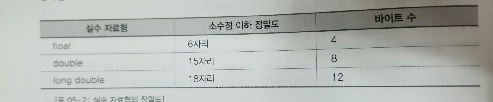

# 상수와 기본 자료형

---

## 자료형이란?

`데이터를 표현하는 기준, 방법`

변수나 상수도 자료형의 기초한다.

변수? `데이터를 저장할 메모리 공간에 붙여진 이름`

## 다양한 자료형이 존재하는 이유

- 데이터의 표현방식이 다르니깐
  - 정수, 실수
  - 근데, 이건 byte, short, int 처럼 정수에서 왜 다시 나뉘는지를 설명하지 못한다
- 메모리 공간의 적정한 사용을 위해서

## 정수 자료형의 선택

- 표현하고자 하는 값의 범위에 따라 다르게만 표현하면 끝인가??
  - nope
  - `일반적으로 CPU가 처리하기에 가장 적합한 크기의 정수 자료형을 int로 정의한다. 
int의 연산속도가 다른 자료형의 연산속도에 보다 동일하거나 빠르다`
  - 그래서 int보다 작은 크기의 데이터는 int로 바꿔서 연산 진행
- 정수형의 경우, 연산의 횟수가 빈번하면, int보다 사이즈가 작더라도 int로 하자
- 그럼 char나 short는?
  - `데이터의 양이 많아서 연산속도보다는 데이터의 크기를 줄이는 것이 중요한 데이트들은 char, short로 표현한다` 

## 실수 자료형의 선택

- float, double 뭐를 기준으로 선택하지?
  - `정밀도`
- 실수는 표현의 오차가 존재 할 수 밖에없다.
- 실수 자료형의 크기가 커지면 커질수록 오차도 줄어들기 마련
- 
- 근데 언제 정밀도까지 따져가면서 프로그래밍을 하냐?
  - 그래서 보편적으로 double을 사용

## Unsigned

- 정수 자료형 한정해서 unsigned 키워드를 추가하면 정수의 표현이 0이상의 값만 표현 할 수 있게된다.
- 즉, MSB가 더 이상 음수, 양수를 가르키는 비트가 되는게 아니라 수를 표현하는 비트로 바뀌게 된다.
- byte: -128 ~ 127, unsigned byte: 0 ~ 255
- unsigned의 반대는 signed (생략가능)

---

## 문자의 표현

- 컴퓨터는 2진수로 표현하는데 문자는 어떻게 표현할까?
  - 숫자를 문자에 연결시키는 매핑이 유일하지 않을까?
- 아스키(ASCII) 코드
  - 알파벳과 일부 특수문자를 포함한 총 128개의 문자를 각각에 맞는 아스키 코드로 매핑
  - 1바이트로 표현하고, 비트 하나는 패리티 비트로 에러검출에 사용된다.
- `char는 정수형이다. 실제로 char 변수에 저장되는것은 정수이다.`

## 상수의 이해

- 상수? 변경이 불가능한 데이터
- 2개의 종류: 이름이 없는 리터럴 상수, 이름이 있는 const 상수
- 리터럴 상수
  - `할당된 메모리 공간에 이름이 없는 상수, 또는 리터럴`
- const 상수

## 자료형의 변환

- 자료형의 변환 = 데이터 표현 방식의 변환
- 자료형 변환의 2가지 방법:
  - 자동 형 변환
  - 강제 형 변환
