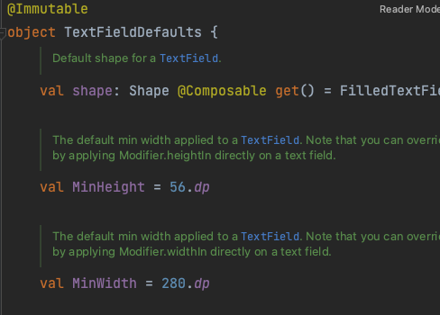

# TextField fillMaxWidth

---

- Compose 기본 composable 중 하나
- 텍스트 입력을 받고 그 외에 material design system을 기반으로 다양한 커스텀을 할 수 있다.
- 알아두면 좋을것은 TextField의 구현을 보면 기본적으로 default 사이즈가 정해져 있다.

```kotlin
@Composable
fun TextField(
    ...
) {
    ...

    CompositionLocalProvider(...) {
        BasicTextField(
            ...
            modifier = modifier
                .defaultMinSize(
                    minWidth = TextFieldDefaults.MinWidth,
                    minHeight = TextFieldDefaults.MinHeight
                ),
            ...
        )
    }
}
```


- 가로와 세로의 최소 길이를 지정해주고 있는데 각각의 값은 280dp, 56dp이다.

- 그래서 모바일 기기의 크기를 가득 채워야 한다면 `.fillMaxWidth()`를 꼭 지정해주자