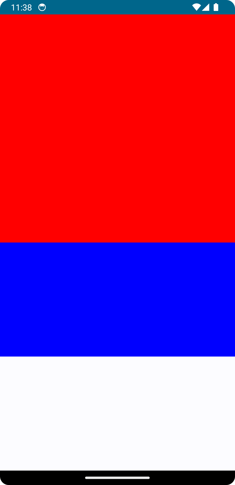

# fillMaxXX시 몰랐던 점



---

인스타그램에서 우연히 본 영상에 두명이 색으로 구분된 영역을 터치하면서 하나의 색이 화면을 꽉 채우면 게임이 끝난다.

뭔가 내기 게임 할 때 재밌을거 있을거 같아 만들어 보았는데 그 과정에서 만났던 modifier 관련 삽질를 공유하고자 한다.

<video src="./img/game_vid.mp4" controls="controls" style="max-width: 730px;"></video>

## 기존에 생각했던 방식

- Column을 하나 만들고,
- state를 활용하여 두 영역 중 하나의 height를 담아둔다.
- 두 영역중 터치가 일어날때마다 저장된 height 값을 +, - 하여 height값이 1.0f이거나 0.0f면 게임이 끝난다.
- 혹시나 다시 하고싶은 사람들이 있을수도있으니 Popup으로 재시작 버튼을 추가하였다.

## 문제 코드

```kotlin
@Composable
fun HopScotchGameScreen(modifier: Modifier = Modifier) {

    var playerRedHeight by remember {
        mutableStateOf(0.5f)
    }

    Column(
        modifier = modifier.fillMaxHeight()
    ) {
        //빨간박스
        BoxArea(
            height = playerRedHeight,
            player = HopScotchPlayer.Red
        ) {
            // 높이 수정 로직
        }
      
        //파란 박스
        BoxArea(
            height = 1.0f - playerRedHeight,
            player = HopScotchPlayer.Blue
        ) {
            // 높이 수정 로직
        }
          ...
    }
}

@Composable
fun BoxArea(
    modifier: Modifier = Modifier,
    height: Float = 1.0f,
    player: HopScotchPlayer,
    onTouch: () -> Unit
) {
    Box(
        modifier = modifier
            .fillMaxWidth()
            .fillMaxHeight(height)
            .background(player.color)
            .clickable {
                onTouch()
            }
    )
}

```

## 결과


원했던 결과가 아니다. 뭘까. 분명한건 modifier 관련 문제인듯하다.

## 문제

사실 답을 자다가 꿈속에서 갑자기 'fillMaxHeight ... from...available space' 문구를 꿈속에서 스냅샷처럼 나오는 걸 꿨다.
어이가 없긴 했지만 뭔가 예전에 한번 본 기억도 나서 찾아보니, 진짜였다.

즉 fillMaxWidth, fillMaxHeight는 `직전 형제 composable들이 화면을 채우고 남은 공간을 기반`으로 적용된다.

```kotlin

@Composable
fun BoxArea(
    modifier: Modifier = Modifier,
    height: Float = 1.0f,
    player: HopScotchPlayer,
    onTouch: () -> Unit
) {
    Box(
        modifier = modifier
            //width에는 형제들이 가로로 배치되어있는게 없으니 화면을 꽉채운다.
            .fillMaxWidth()
            //여기가 문제점. Column으로 부모 composable을 정의했기에 
            //파란색 Box의 크기는 빨간색 Box가 채우고 남은 공간을 기반으로 계산된다.
            .fillMaxHeight(height)
            .background(player.color)
            .clickable {
                onTouch()
            }
    )
}

```

그리고 fillMaxWidth, fillMaxHeight에 들어가는 fraction 파라미터는 `남은 공간에서 얼마나(퍼센트)`를 차지 할 것인가에 대한 값이다.

그러니 멍청하게

`아? 초기 값은 박스 둘다 반반씩 차지하는거니깐 0.5f, 0.5f, 그리고 터치하면서 숫자가 바껴도 결국 둘의 합은 1.0f깐 넣으면 되겠디!?` 이런 생각을 한거다

## 그럼 어떻게 해결?

### 1. fillMaxHeight를 유지 할 경우

- BoxArea의 height 파라미터의 default 값을 1.0f로 하고 파란색 박스는 height를 파라미터로 넣지않는다.
- 결국, `빨간색 박스의 height만 바꿔주는 방식`

```kotlin
@Composable
fun HopScotchGameScreen(modifier: Modifier = Modifier) {
    ...
    Column(...) {
        //빨간색 박스
        BoxArea(
            height = playerRedHeight,
            player = HopScotchPlayer.Red
        ) {
            //높이 바꾸는 로직
        }

        //파란색 박스
        BoxArea(
            player = HopScotchPlayer.Blue
        ) {
          //높이 바꾸는 로직
        }
        ...
    }

    @Composable
    fun BoxArea(
        modifier: Modifier = Modifier,
        height: Float = 1.0f,
        player: HopScotchPlayer,
        onTouch: () -> Unit
    ) {
        Box(
            modifier = modifier
                .fillMaxWidth()
                .fillMaxHeight(height)
                .background(player.color)
                .clickable {
                    onTouch()
                }
        )
    }
```
- 이 단편적인 접근의 문제점은
  - 이 게임의 구조는 빨간색박스 높이 + 파란색 박스 높이 = 1.0f이다
  - 하지만 빨간색 박스의 높이는 Column, 부모 composable의 전체 높이에 의존적이고,
  - 파란색 박스는 Column, 부모 composable의 `남아 있는 공간`에 의존적이다.
  - `즉, 같은 제약상황을 따르고 있지 않다.`

### 2. Weight modifier의 이용

weight modifier는 Row, Column scope내에서 사용되는 특별한 modifier로 Row, Column내에 자식들이 어느정도의 크기를 가져야하는지를 결정한다.

즉 weight를 이용하면 같은 제약상황(Column의 전체 높이)를 기반으로 크기를 지정 할 수가 있단 의미가 된다.

```kotlin
@Composable
fun HopScotchGameScreen(modifier: Modifier = Modifier) {

  ...
  
  Column(...) {
    //빨간색 박스
    BoxArea(
      modifier = modifier
        .fillMaxWidth()
        .weight(playerRedHeight),
      player = HopScotchPlayer.Red
    ) {
      //높이 바꾸는 로직
    }

    //파란색 박스
    BoxArea(
      modifier = modifier
        .fillMaxWidth()
        .weight(playerRedHeight),
      player = HopScotchPlayer.Blue
    ) {
      //높이 바꾸는 로직
    }
    ...
  }

}
```
- 굳이 height를 BoxArea의 파라미터로 넘길 필요도 없다.
- 그리고 같은 조건, 제약사항을 기반으로 높이를 계산한다.

중복이 보인다. 하지만 weight modifier는 특정 scope(Row, Column)에서만 적용된다.

그냥 BoxArea를 ColumnScope에서만 선언 할 수 있도록 바꾸자.


```kotlin

@Composable
fun HopScotchGameScreen(modifier: Modifier = Modifier) {

  var playerRedHeight by remember {
    mutableStateOf(0.5f)
  }

  Column {
    //빨간박스
    BoxArea(
      height = playerRedHeight,
      player = HopScotchPlayer.Red
    ) {
      //높이 수정 로직
    }

    //파란박스
    BoxArea(
      height = 1 - playerRedHeight,
      player = HopScotchPlayer.Blue
    ) {
      //높이 수정 로직
    }
      ...
  }

}

@Composable
//여기 수정
fun ColumnScope.BoxArea(
  modifier: Modifier = Modifier,
  height: Float = 1.0f,
  player: HopScotchPlayer,
  onTouch: () -> Unit
) {
  Box(
    //여기수정
    modifier = modifier
      .fillMaxWidth()
      .weight(height)
      .background(player.color)
      .clickable {
        onTouch()
      }
  )
}

```