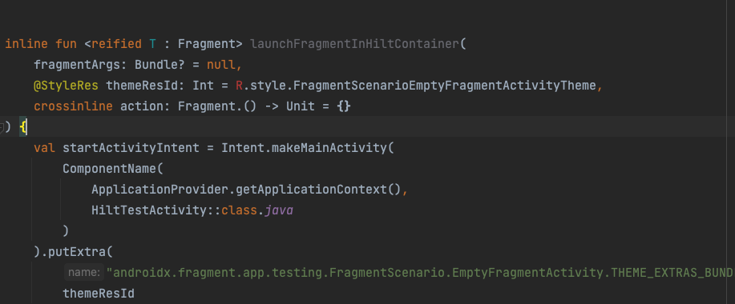
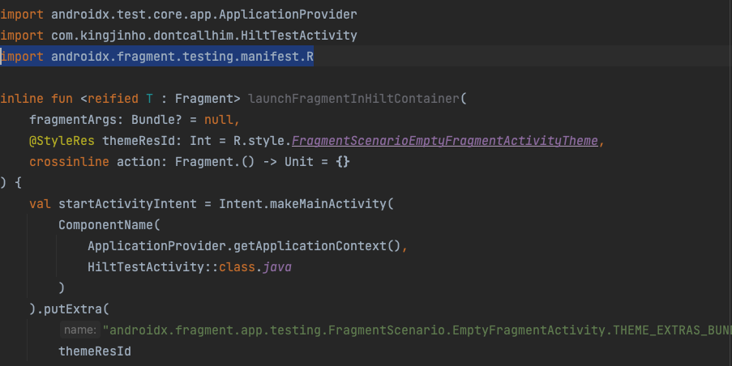

# Hilt fragment 테스트시 launchFragmentInHiltContainer() 생성자 파라미터 R을 못찾을때

---

안드로이드 앱에서 hilt를 사용하고 있다면, 테스트 케이스를 작성할때도 hilt관련 설정을 해야한다.

그러다 보면 UI 테스트에서 fragment를 테스트 해야할 경우가 있는데, 공식 문서에서는  [launchFragmentInHiltContainer](https://developer.android.com/training/dependency-injection/hilt-testing#launchfragment)
을 사용하여 테스트를 진행하라고 한다.

결국 해당 깃허브 코드에 가서 관련 인라인 함수를 복붙해서 오면 생성자 파라미터에 사진과 같이 R이 import가 안되는 상황이 발생한다.

그럴때는 import 문에 `import androidx.fragment.testing.manifest.R` 을 추가하자.

