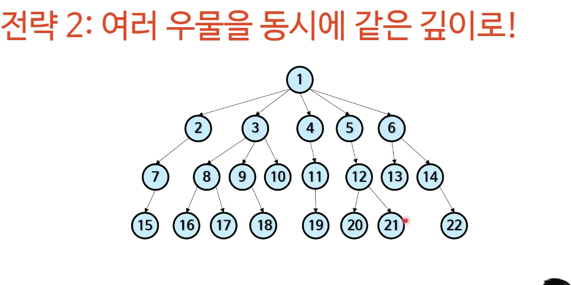
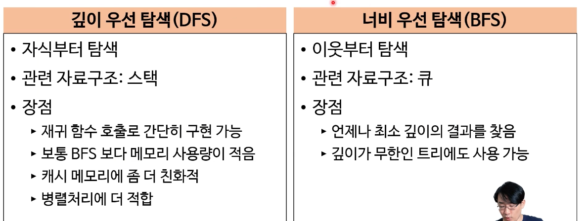

# DFS & BFS

---

Q: 트리 자료구조 속에 있는 데이터를 찾을 때 어떤 방식으로 찾을건가?

## DFS: 한 우물부터 깊이

- 깊이 우선 탐색
- 재귀적, 비재귀적으로 가능
- 스택으로 가능
    - 왜???
- 미로찾기

## BFS: 여러 우물을 동시에 같은 깊이로

- 너비 우선 탐색
    - 같은 레벨로
- 큐를 사용해서 가능
    - 왜???
- 최단 경로 찾기
  

## DFS vs BFS

## Graph에서 DFS BFS를 사용 할 수 있을까?

- [그래프 정의](../graph/index.html)
- 잘못하면 무한루프가 돌수도있다!
  - 그러면 결국 방문했던 노드들을 기억해야 함!

## 디렉토리 출력

## 미니맥스 알고리즘

- 최대값을 최소화시킨다
- 제로섬
