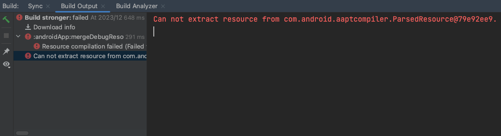
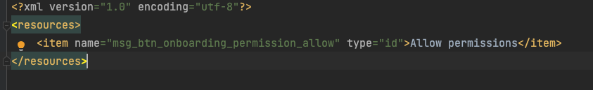

# 안드로이드 res 파일 파싱 에러

---

개인 프로젝트를 하다가 갑자기 문자열 파싱이 안되어있다는 에러 메세지를 받았다.

분명히 다시 체크 했는데도 불구하고 계속 메세지가 나오길래 체크해본 결과 발견한 이슈는 다음과 같았다:



문자열을 추가 할 때 나도모르게 R.id.xxx를 사용하고 추가를 누르면 이때는 ids.xml에서 생성이 된다.

이렇게 생성이 되면 아래 이미지처럼 생성이 되는데

이때는 리소스를 참조하거나 비어있어야 한다.

내 케이스에서는 이 이유 때문에 에러가 났다.



ids.xml을 지워주면 에러는 금방 해결되지만 에러 메세지가 이상하게 나와서 잠깐 해맸다.

``` kotlin

//안드로이드 스튜디오에 나온 에러 메세지:

/Users/jinhoshin/.gradle/caches/transforms-3/b16487f17b6ef3f2b056d7bad9bf7f0c/transformed/navigation-runtime-2.7.5/res/values/values.xml:2:4: <item> inner element must either be a resource reference or empty.


/Users/jinhoshin/AndroidStudioProjects/stronger/androidApp/src/main/res/values-ko/strings.xml:2:4: <item> inner element must either be a resource reference or empty.
```

[혹시나 같은 에러지만 다른 이유라면 여기로](https://stackoverflow.com/questions/72335789/can-not-extract-resource-from-com-android-aaptcompiler)